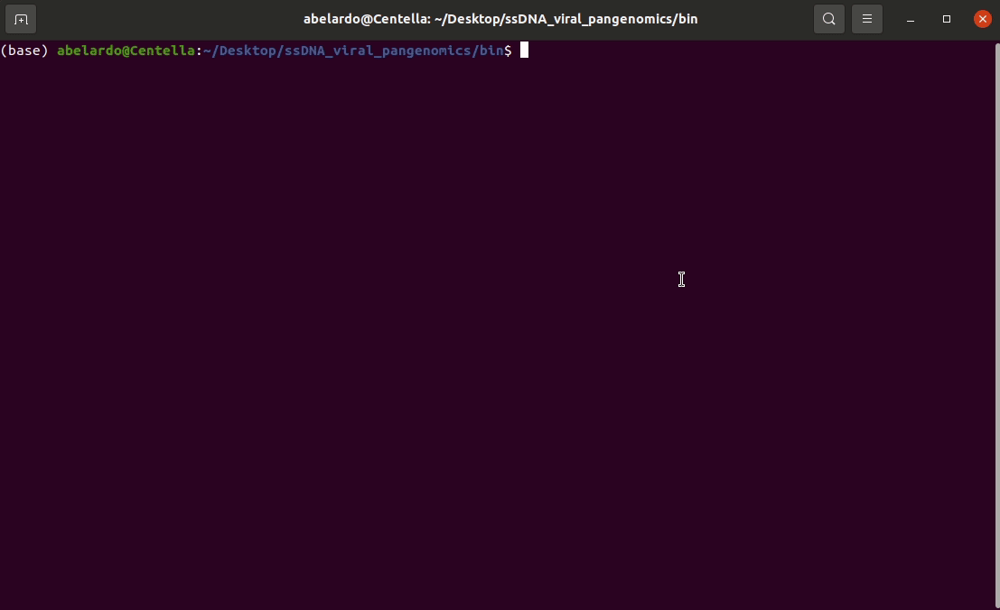

# **ssDNA viral pangenomics**

in brief...

**Viruses are a polyphyletic group**. Due to the lack of common evolutionary markers among all viruses, artificial classifications not supported by evolutionary trees, have arisen. Furthermore, viral lineages present a large number of horizontal transport events with their hosts, thus carrying multiple genes of cellular origin **defying classical evolutionary schemes**.

The origin, or multiple origins of viruses **is an inconclusive research topic that requires shifts in the classic paradigms and recent evolutive analysis tools**.

This repository shows the workflow used to study the **origin of single-stranded DNA viruses from an integrative perspective** that makes use of **pangenomics** for the detection of relevant clusters for the group origins, **alignment free methods for whole-genome comparisons**, and phylogenetic inference methods compatible with **network evolutionary schemes**, allowing the incorporation of cellular protein sequences to perform remote homologues searches.

>## **Cloning this repo**

ssDNA\_viral\_pangenomics is a repository that depends on other github repositories. To avoid not allowed re-distribution of used files from those repositories, we included a [.gitmodules file](https://git-scm.com/book/en/v2/Git-Tools-Submodules). Because of that, you should clone this repo as follows.

``` 
git clone https://github.com/abelardoacm/ssDNA_viral_pangenomics.git
cd ssDNA_viral_pangenomics/
git submodule init
git submodule update
cd bin/FSWM/
make
#To get mashv2.2 release if using Linux64
cd .. | mkdir mash
cd mash
wget https://github.com/marbl/Mash/releases/download/v2.2/mash-Linux64-v2.2.tar
tar -xvf mash-Linux64-v2.2.tar
```
>## **Dependencies**
These are ssDNA_viral_pangenomics external dependencies, links to their installing instructions, commands for installation, and used versions:
 
 | Software name (version used) 	| Terminal 	| Installation *debian based dist. 	|
|-	|-	|-	|
| [EMBOSS](http://emboss.sourceforge.net/download/) (6.5.7) 	| bash 	| `sudo apt-get install emboss` 	|
| [Biopython](https://biopython.org/wiki/Download) (1.78) 	| bash 	| `sudo apt-get install python3-biopython` 	|
| [Numpy](https://numpy.org/install/) (1.19.4) 	| bash 	| `sudo apt-get install python3-numpy` 	|
| [MATLAB](https://la.mathworks.com/products/matlab.html) (R2020b)<br>+ bioinformatics toolbox 	| bash 	| `online installation via installation script` 	|
| [NbClust](https://cran.r-project.org/web/packages/NbClust/index.html) (3.0) 	| R (4.0.3) 	| `install.packages("NbClust")` 	|
| [factoextra](https://rpkgs.datanovia.com/factoextra/index.html) (1.0.7) 	| R (4.0.3) 	| `install.packages("factoextra")` 	|
| [tidyverse](https://www.tidyverse.org/) (1.3.0) 	| R (4.0.3) 	| `install.packages("tidyverse")` 	|
| [Corbi](https://cran.r-project.org/web/packages/Corbi/index.html) (0.6-1) 	| R (4.0.3) 	| `install.packages("Corbi")` 	|
| [xts](https://cran.r-project.org/web/packages/xts/xts.pdf) (0.12.1) 	| R (4.0.3) 	| `install.packages("xts")` 	|

Install **R** dependencies by running `install.packages(c("NbClust", "factoextra", "tidyverse", "Corbi", "xts"))`
<br/>
Install **bash** dependencies with `sudo apt-get install emboss python3-biopython python3-numpy -y`


>## **Repo tree**

These are the key repository folders :

``` 
.
├── bin <-  Contains scripts and dependencies
│
├── data
│   ├── AF_methods_input <- Aligment free methods input
│   ├── Genomic_fasta_files <- Individual fasta nucleotides genomic files
│   ├── Individual_full_genbank_files <- Individual full genbank files
│   ├── Mash_input <- Subfolders inputs to mash
│   ├── Proteomic_fasta_files <- Individual fasta aminoacids proteomic files
│   └── Raw_database <- Direct NCBI downloads
│
└── results
    ├── Clustering_graphics <- PCA's of clustering schemes
    ├── CPFSCC_vectors <- Cumulative fourier spectra vectors by family
    ├── Distance_Matrices <- Symmetric paired distances
    ├── Lists_for_sample_reduction <- List of n most distant files to delete
    ├── Mash_distances <- Mash output
    ├── Mash_sketches <- Mash midfile
    ├── Master_reports <- Summary of master script runs
    ├── NbClust_membership_vectors <- Text files with individual file membership
    └── Pangenomic_input_clusters <- Finall folders ready to serve as GETHOMOLOGUES input
```
_NOTE\* for storage purposes only files corresponding to Geminiviridae family are available. Whole database output will be available before research results submission_

# Repo navigation guide

<p align="center">
  
</p>

>## **Getting started**

After cloning the repo, everything you need to get started are concatenated full genbank files in the [**Raw_database folder**](data/Raw_database).

This folder should contain direct downloads from NCBI refseq. 

Viral sequences can be searched family by family with the following general query:

``` 
Family [ORGANISM] AND srcdb_refseq[PROP] NOT wgs[prop] NOT cellular organisms[Organism] NOT AC_000001:AC_999999[pacc]
```

Results from queries are downloaded in Genbank(full) format as follows:


>## **Repo usage example**

Below is an example of using all currently implemented steps, in a single call to the master script for the [sample input of Geminiviridae family](data/Raw_database/Geminiviridae.gb):



The outcome is summarized in a master report for the family, that you can find in [results/Master_reports](results/Master_reports). It will save the selected parameters to perform each individual step, as well as the ins and outs locations.

>## **Individual steps and details**

The usage example only shows what happens when you call `0.1_Master_Driver.sh` from bin and type the option **0** to perform all steps. However each step can be performed individually independent of the master script. For that purpose we've created a bin README file, that you can check [**here**](bin/README.md).


