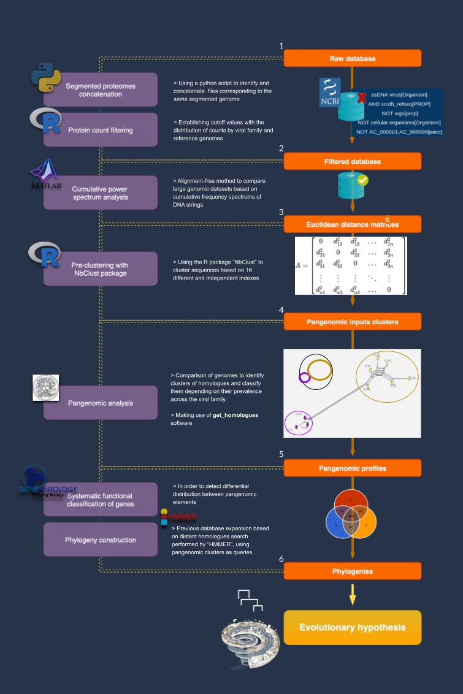

# **ssDNA viral pangenomics**

in brief...

**Viruses are a polyphyletic group**. Due to the lack of common evolutionary markers among all viruses, artificial classifications not supported by evolutionary trees, have arisen. Furthermore, viral lineages present a large number of horizontal transport events with their hosts, thus carrying multiple genes of cellular origin **whose history defies classical evolutionary schemes** with tree topologies.

The origin, or multiple origins of viruses **is an inconclusive research topic that requires shifts in the classic paradigms** of evolutionary biology.

This repository shows the workflow used to study the **origin of single-stranded DNA viruses from an integrative perspective** that makes use of **pangenomics** for the detection of sequences with phylogenetic signal, phylogenetic inference methods under **network evolutionary schemes** and Bayesian genomic methods of **ancestral state reconstruction**.




Here's what you will find inside [bin](bin/) and [data](data/)


>## **data/**


#### **Raw_database**

This folder contains direct downloads from NCBI refseq. Sequences were downloaded family by family with the following general query:

``` 
Family [ORGANISM] AND srcdb_refseq[PROP] NOT wgs[prop] NOT cellular organisms[Organism] NOT AC_000001:AC_999999[pacc]
```

Results from queries were downloaded in Genbank(full) format including GI. 

The perl scripts **Genbank_to_genomic_fasta_taxid_in_name.pl** and **Genbank_to_proteomic_fasta_taxid_in_name.pl** were used to split the global genbank file into genomic and proteomic fasta files, each file is named as follows: *"organism_taxid_.faa or .fn"*.

Files within this folder are the input for [1_Segmented_proteomes_concatenation.py](bin/1_Segmented_proteomes_concatenation.py) and [2_Protein_count_filtering.sh](bin/2_Protein_count_filtering.sh)

#### **Filtered Database**

This folder contains the remaining genomes from the protein counts filter, as well as the concatenation of segmented genomes into single files. It consists of 1204 reference genomes. 

Files within this folder are the input for [3_Power_spectrum_analysis.mat](bin/3_Power_spectrum_analysis.mat). An alignment-free method to compare large genomic datasets based ond cumulative frequency spectrums of DNA strings.


#### **Euclidean Distance Matrices**

Output matrices of eculcidean distances between each and every pair of genomes from the power spectrum analysis. These matrices are the input for the clustering algorithms: [4_Common_statistic_clustering.r](bin/4_Common_statistic_clustering.r). Consensus clusters were then obtained by [5_Consensus_clustering.sh](bin/5_Consensus_clustering.sh).


#### **Proteomes clusters**

This directory contains the files grouped by folders corresponding to the same consensus clusters. Such clusters are then called to the pangenomic analysis via **[get_homologues software](https://github.com/eead-csic-compbio/get_homologues)**. In our particular case the script [6_Get_homologues_routine.sh](bin/6_Get_homologues_routine) contains the actions to call get homologues software and sort the output pangenomic profiles.


#### **Pangenomic profiles**

WIP


#### **Phylogenies**

WIP


>## **bin/**

This directory contains the aforementioned scripts

  * **[1_Segmented_proteomes_concatenation.py](bin/1_Segmented_proteomes_concatenation.py)** Identifies the files corresponding to segmented genomes by making pairwise comparisons bewtween filenames and checking wether its text distance is under the tresshold value set by user (2 for ssDNA files).
  * **[2_Protein_count_filtering.sh](bin/2_Protein_count_filtering.sh)** Stablishes cutoff values with the distribution of the protein counts by viral family and reference genomes set by the user. 
  * **[3_Power_spectrum_analysis.mat](bin/3_Power_spectrum_analysis.mat)** Perform a cumulative power spectrum analysis to create a 27 dimensions vector for each genome and computes the euclidean pairwise distances.
  * **[4_Common_statistic_clustering.r](bin/4_Common_statistic_clustering.r)** Uses NbCLust software package in R to compute 16 different and independent indexes of clusters identification. Clustering profiles are obtained as membership vectors.
  * **[5_Consensus_clustering.sh](bin/5_Consensus_clustering.sh)** Identifies the majority consensus clusters from the NbClust clustering and network-based clustering
  * **[6_Get_homologues_routine.sh](bin/6_Get_homologues_routine)** Invokes the get_homologues software to compute the pangenomic analysis, finally obtaining the homologues pangenomic profiles.


